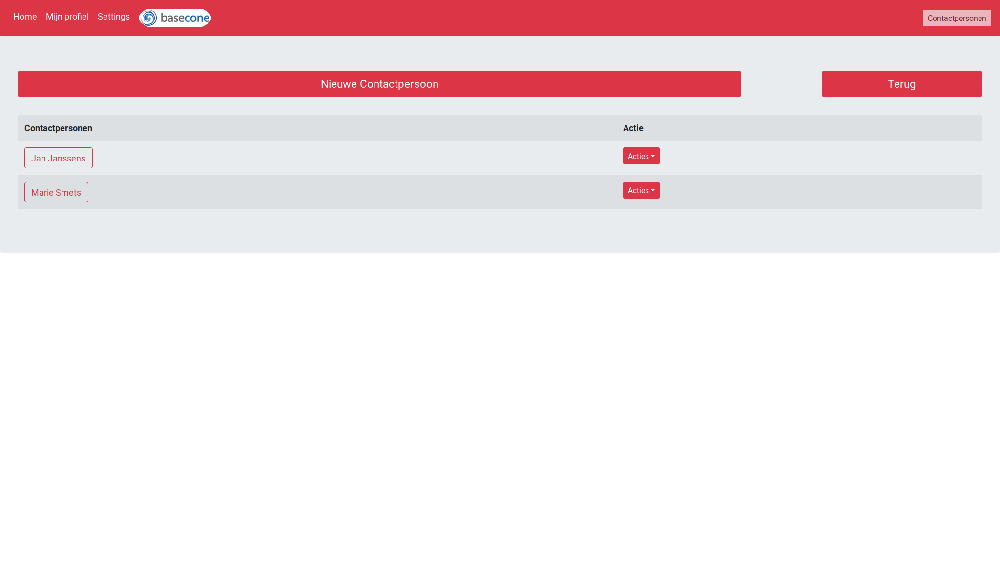

# Invoice-administration

This program is mainly used for managing and administrating invoices and generating them into .pdf format

Version 2.0(beta) is out. We are still improving and adding things on a daily basis.
This is not a finished product, but you can still contribute and test it out.

This project is translated in 2 languages, Dutch and English.

This program is created and maintained for [www.mdsart.be/](https://www.mdsart.be/)

about
--

Functionalities:
  - Add contacts, invoices, quotations, offers, materials
  - A yearly chart (automatically updated);
  - Downloadable pdfs for Invoices, quotations and offers
  - Upload your logo to use on the pdf's.
  - Your profile can be edited
  - All documents have a switch, to keep that it has been payed or not.
  - Calculations (inch to cm, precentages, using your materials calculating how much something costs, ...)
  - A search function
  - 5 different themes
  - The whole program is lock under a password, so you can safely host this on a public domain.
  - changeable text for the pdf's
  - 2 languages: English and Dutch

### How to Install

 - local:
  `docker-compose up --build`
 - synology/hub.docker:
 
  start container [mongo](https://hub.docker.com/_/mongo) first.
  start container [invoice-administration](https://hub.docker.com/repository/docker/snakehead007/invoice-administration) second, with link to mongo container as 'mongo'.

### About (technical)
All data is kept locally by mongodb.

(Changing from computer, you will have to export and import all data manually,for now.)

The front end view is handled by 'Jade' and the backend is runned by 'nodejs'.

All the request are run with 'Express'.

For more information about all the packages that are used in this project check the [wiki](https://github.com/snakehead007/simple-invoice-administration/wiki) .

Installation and preparation
--

Check the [wiki](https://github.com/snakehead007/simple-invoice-administration/wiki) for more information.

The default password is "password".

Screenshots
-

Future plans
-
* Currently on the work of a total rework, making everything future proof and security first.
* In the future the view engine, Pug, will be replace by React or Angular.
* When this project comes out of beta, you'll be able to rent a hosted server for a monlty fee.
