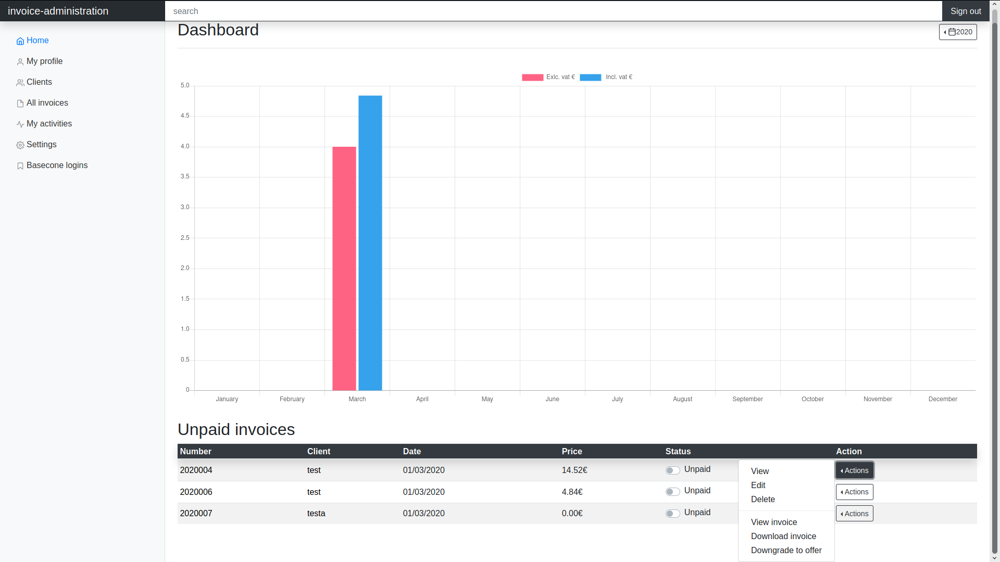
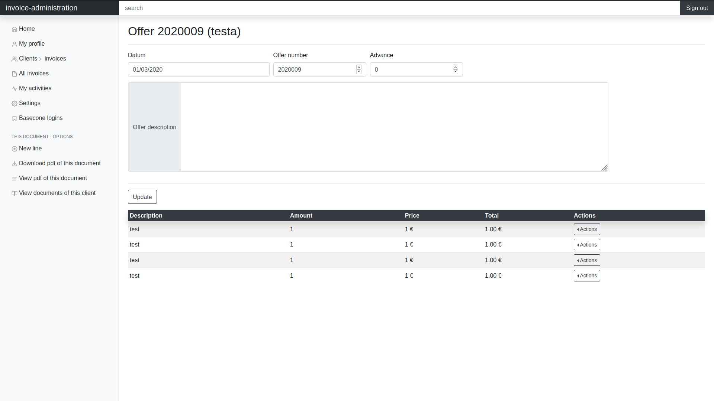
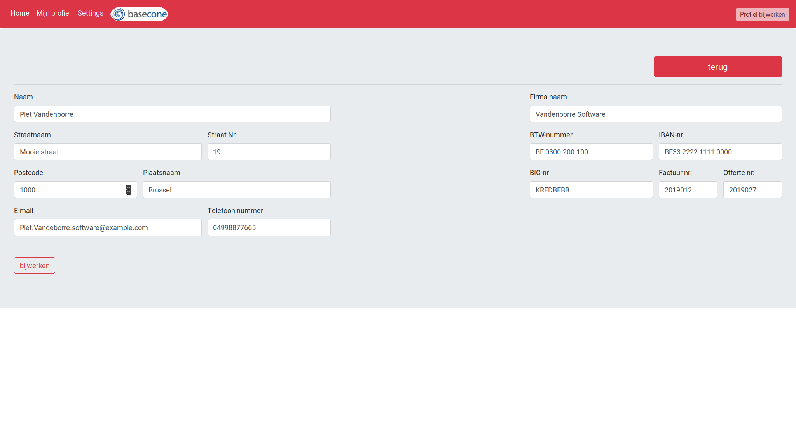
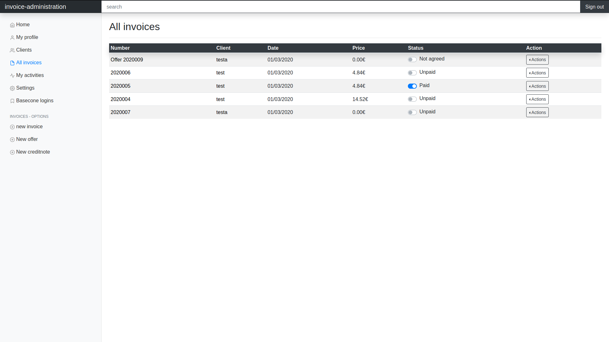
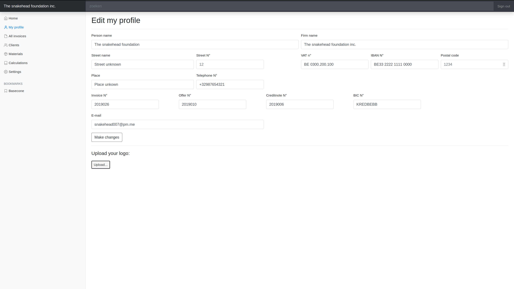
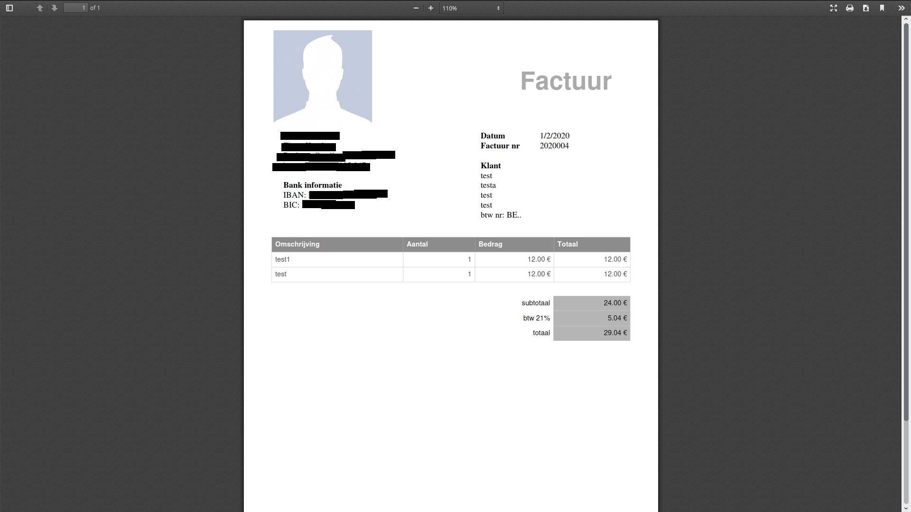

# simple-invoice-administration
this program is used for managing and administrating invoices and generating them into .pdf format

v1.8: stable

about
--
You can add contacts, invoices and quotations.
Quotations can be upgraded to an invoice.
Both invoices and quotations are available for download.
The ability to edit your own profile for the invoices and quotations are also available.
For invoices there is a switch, to keep that it has been payed or not.
Other functionalities are:
  - yearly chart
  - adding materials (with calculations)
  - calculations (inch to cm, percentage, ...)
  - search function

There are 4 themes: Grey, Dark, White, Blue, Red

All data is kept locally by mongodb.
Changing from computer, you will have to export and import all data manually (for now)

Installation and preparation
--

Check the [wiki](https://github.com/snakehead007/simple-invoice-administration/wiki) for more information.

Screenshots
-

